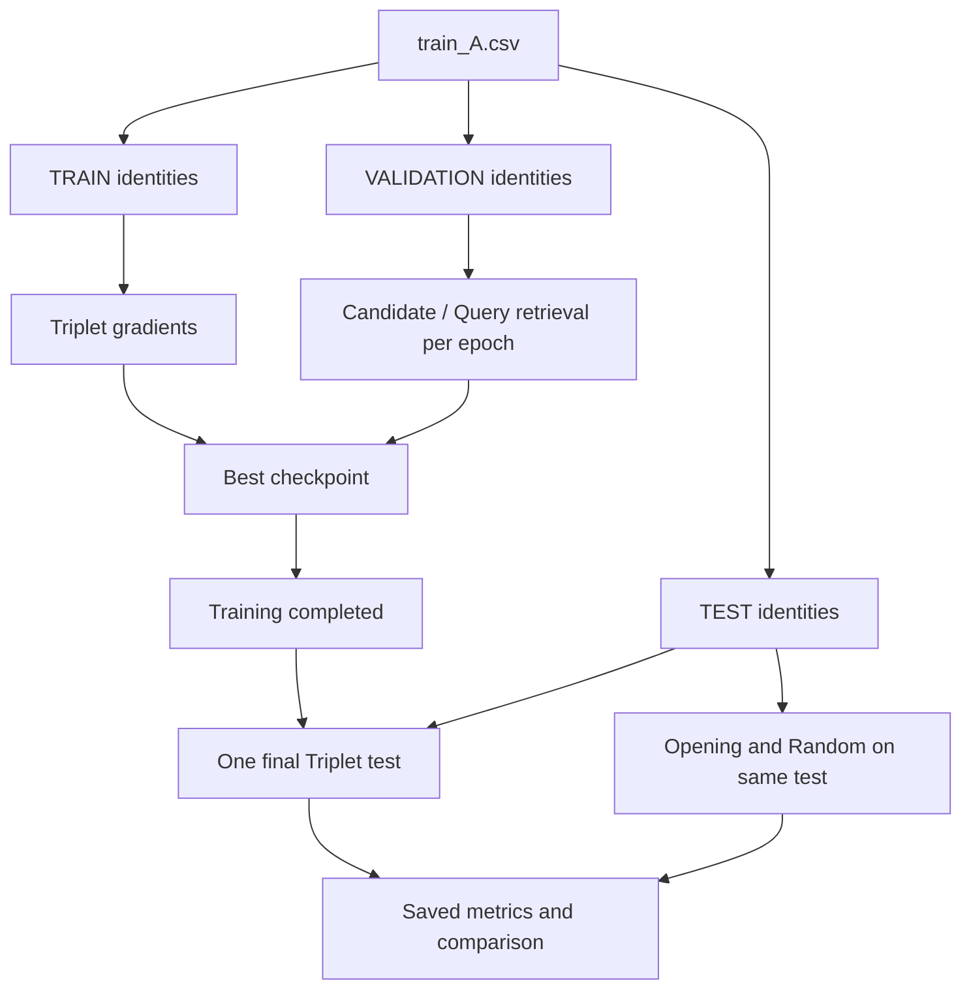

# Phase 2.5：可信的 Train / Validation / Test 實驗

## 本輪修正

Phase 2 每個 epoch 使用 held-out players 的分數選 checkpoint，因此該群是 validation，不能再報成 final test。本輪保留相同 17-channel 特徵、ResNet、Triplet Loss 及 Opening Fingerprint，只修正實驗設計與重現資訊，沒有加入 Strength Estimator、MiniZero 或其他模型。



三個 identity pools 完全互斥。TRAIN 只做梯度；VALIDATION 用於選最佳 epoch；TEST 只在訓練完成且 checkpoint 固定之後做最終評估。不能看到 test 分數後再挑 epoch、seed 或調整模型，否則 test 也會退化成 validation。

## 切分與 audit

固定 seed，先依玩家整理、去除同玩家重複棋譜，先為棋譜數要求較高的身份池分配玩家，再隨機取固定盤數。玩家不足明確報錯，不降低要求。

正式輸出：

```text
outputs/splits/
├── train.csv
├── val_candidates.csv
├── val_queries.csv
├── val_ground_truth.csv
├── test_candidates.csv
├── test_queries.csv
├── test_ground_truth.csv
└── split_audit.json
```

Audit 包含 TRAIN/VAL/TEST 玩家數、五組棋譜數、seed、來源 CSV SHA-256 與各切分 SHA-256。三組玩家交集檢查 3 項；五組棋譜的兩兩配對共 10 組，game_id 與 sgf_content 各檢查一次，共 **23 項**。任何交集非零直接報錯。

SGF overlap 是字串完全相等，不是 canonicalized 落子序列；同棋局改註解可能未被識別。Query 沒有 player_id/rank。Ground truth 僅用於稽核和該資料層的評分，不是模型輸入。

## 安裝與正式 quick

沿用 README 的 Python 3.10+、venv 與 `requirements-triplet.txt` 安裝流程。只先驗證 pipeline，不追求高分：

| 設定 | real_quick.yaml |
| --- | --- |
| TRAIN / VAL / TEST players | 30 / 10 / 10 |
| TRAIN games/player | 10 |
| VAL candidate/query games | 10 / 5 |
| TEST candidate/query games | 10 / 5 |
| history / sampled positions per game | 8 / 4 |
| channels / blocks / embedding dim | 32 / 4 / 64 |
| epochs / batch size / triplets per epoch | 3 / 16 / 512 |
| learning rate / margin | 0.001 / 0.2 |

將官方資料放在 `data/training/train_A.csv` 後：

```powershell
powershell -ExecutionPolicy Bypass -File scripts/run_real_quick.ps1
```

腳本優先使用 `.venv\Scripts\python.exe`，亦可 `-Python "C:\path\to\python.exe"`。缺少資料時印出以下訊息並停止，不產生假 real 成績：

```text
Please place the official train_A.csv at data/training/train_A.csv
```

## 九步流程與逐步命令

```powershell
python -m src.build_metric_split --config configs/real_quick.yaml
python -m src.player_features --config configs/real_quick.yaml
python -m src.analyze_feature_coverage --config configs/real_quick.yaml
python -m src.train_triplet --config configs/real_quick.yaml
python -m src.evaluate_test --config configs/real_quick.yaml
python -m src.random_baseline --config configs/real_quick.yaml
python -m src.opening_test --config configs/real_quick.yaml
python -m src.compare_baselines --config configs/real_quick.yaml
python -m src.experiment_summary --config configs/real_quick.yaml
```

Preprocessing 在訓練之前為五組各自建立壓縮特徵，coverage 可讀取五組 manifest 統計；**訓練程式本身**只開 TRAIN/VAL CSV 與 cache，不開任何 TEST CSV/cache/ground truth。這項隔離以實際攔截檔案 I/O 的測試驗證。

Training log 有 epoch、train_loss、val_top1/3/5、val_competition_score、elapsed_time（另保留 learning rate 與舊欄位）。Best 只依 VAL score；同分保留早期 epoch。

`training_state.json` 在開始訓練時標記 running，所有 epochs 完成才標記 completed，綁定設定與 selected checkpoint SHA。`evaluate_test` 先確認完成狀態與固定的 best.pt，之後才讀 TEST ground truth。成功後保存 receipt，同一 run 再次執行會拒絕；失敗、未完成、設定或 checkpoint 改變都不能當作有效 final test。

重新執行完整 pipeline 是新的訓練 run，不是 resume。這個機制避免意外重測，但不能取代研究者不依 test 結果調參的原則。

## 三個 baseline 的公平比較

Triplet 使用現有 position → game mean → group mean → L2 normalize → cosine ranking。Opening 使用原始前 40 手 heatmap 方法。Random 以固定 seed 對每題隨機排列候選身份，Top-5 無重複；random CSV 的 similarity=0 是佔位值，不代表模型相似度。

三個方法都用相同 `test_candidates.csv`、`test_queries.csv`、`test_ground_truth.csv`；結果 metadata 保存相同來源 hashes。Opening 與 Random 也在訓練完成、Triplet final test 保存後才執行。比較只讀取已保存且驗證過的 metrics，不再次跑模型或重新評估 Triplet。

如果某些棋譜解析失敗，各特徵方法依既有規則跳過並記錄，仍使用全部原始題目當分母；整題沒預測得 0。Random 從原始全部候選身份抽樣，不因神經模型的解析失敗縮小候選池。

## Coverage 和實驗紀錄

`outputs/results/feature_coverage.csv` 分 TRAIN、VAL candidate/query、TEST candidate/query，記錄總盤數、成功/失敗/成功率、平均/中位數/最少/最多 sampled positions。失敗棋譜計為 0 個 positions，分母是全部棋譜，不只成功棋譜。「成功」代表解析、重播和特徵取樣都成功。

`experiment_summary.json` 包含 seed、Python/PyTorch 版本、CUDA、GPU name（若有）、config、dataset SHA-256、best epoch/validation score、final test metrics、三方法成績、訓練與全流程時間。設定路徑只保留專案相對路徑；外部絕對路徑遮蔽，不記錄 user/home/interpreter 路徑。

`total_elapsed_seconds` 由一鍵流程量測，包含 mock 生成（若指定）、各階段與 summary；獨立執行 summary 沒有全流程碼錶，該值可為 null。保留結果時請勿在 test 後改設定；改設定須使用新的實驗目錄且遵守不可用 test 調參。

主要結果：

```text
outputs/results/
├── test_predictions.csv / test_metrics.csv / test_evaluation.csv
├── random_test_predictions.csv / random_test_metrics.csv / random_test_evaluation.csv
├── opening_test_predictions.csv / opening_test_metrics.csv / opening_test_evaluation.csv
├── baseline_comparison.csv
├── feature_coverage.csv
├── training_log.csv
├── final_test_receipt.json
└── experiment_summary.json
```

## 手動 multi-seed

Quick 預設只 seed 42，不自動跑多種子。正式資料就緒後手動執行：

```powershell
python scripts/run_multi_seed.py --seeds 42 123 2026
```

各 seed 全流程輸出到 `outputs/seed_42/`、`seed_123/`、`seed_2026/`；每個目錄保存當次 config。最後 `outputs/results/multi_seed_summary.csv` 欄位為 method,seed,top1,top3,top5,competition_score，seed=mean/std 表示彙總列。Std 採 sample std（ddof=1）；只跑一個 seed 時 std=0。

Multi-seed 使用同一份來源 CSV，seed 同時控制身份切分、回合抽樣與模型訓練，因此不是「固定 TEST，只改權重初始化」實驗。要隔離某一因素，後续可設計固定 split/多 training seeds。請預先固定配置並報告全部 seeds，不挑最高 test score。

## Mock 驗證與目前正式結果

Mock 是 14 位合成玩家、84 盤，4 TRAIN／4 VAL／6 TEST；16 盤 TRAIN、12/8 盤 VAL candidate/query、18/12 盤 TEST candidate/query。僅用於 **pipeline validation**，不是模型效果。

```powershell
powershell -ExecutionPolicy Bypass -File scripts/run_real_quick.ps1 -Mock
```

Mock 輸出全部在 `outputs/phase25_mock/`，來源是 `data/mock/phase25_train_A.csv`，不污染正式資料與正式結果目录。當前暫存 interpreter 的命令見 README。

2026-10-06 驗證：42 項 tests、syntax/import/依賴檢查及完整 mock 流程通過。23 項 overlap 為 0；五組成功率 100%，每盤 positions 的平均/中位數/min/max 都是 4。Mock best epoch=3，validation score=0.841970。

| 僅供流程驗證的 Mock TEST | Top1 | Top3 | Top5 | Score |
| --- | --- | --- | --- | --- |
| Random | 0.166667 | 0.500000 | 0.833333 | 0.261886 |
| Opening | 0.833333 | 1.000000 | 1.000000 | 0.894647 |
| Triplet | 0.333333 | 0.666667 | 1.000000 | 0.423308 |

**正式 train_A.csv 不存在，real quick 與 real multi-seed 尚未執行。** 教授報告的 real 結果保持未填，不用 mock 分數替代。

## 限制與下一步

先取得正式資料，檢查 feature coverage、解析錯誤和 random 對照；再手動執行三個 seed，報告 mean/std。模型仍是原本簡單 ResNet、隨機 triplets 與少量 positions，尚無 hard negatives 或完整 ko/superko 驗證。SGF overlap 只檢查字串。不要從六題 toy test 推論優劣。

Phase 3 預計研究 Strength-aware Player Identification；本輪未加入 Strength Estimator。

## 本輪檔案清單

修改：

- `src/build_metric_split.py`：三層身份切分、23 項交集 audit、訓練專用讀取器。
- `src/train_triplet.py`：VAL 選 checkpoint、TRAIN/VAL-only I/O、完成狀態與 log。
- `src/player_features.py`：五組獨立 preprocessing，保留舊兩層流程。
- `src/feature_cache.py`：VAL/TEST cache 分開，空 query 可得 0 分。
- `src/compare_baselines.py`：三個方法共用固定 TEST、只比較保存的 metrics。
- `src/create_metric_mock_data.py`：可指定玩家數及獨立 mock 輸出路徑。
- `README.md`、`data/README.md`、`docs/phase2.md`、`docs/professor_update.md`：三層架構、操作、歷史範圍與報告。

新增：

- `src/evaluate_test.py`、`src/random_baseline.py`、`src/opening_test.py`。
- `src/analyze_feature_coverage.py`、`src/experiment_summary.py`、`src/experiment_state.py`、`src/run_experiment.py`。
- `configs/real_quick.yaml`、`configs/phase25_mock.yaml`。
- `scripts/run_real_quick.ps1`、`scripts/run_multi_seed.py`、`scripts/__init__.py`。
- `tests/test_phase25.py`、`docs/phase25.md`。

產物：`data/mock/phase25_train_A.csv`、`outputs/phase25_mock/` 下的 split/cache/checkpoint/結果/summary。原有 Opening 與 Phase 2 fixtures/tests 保留；未產生正式或 multi-seed 成績。
